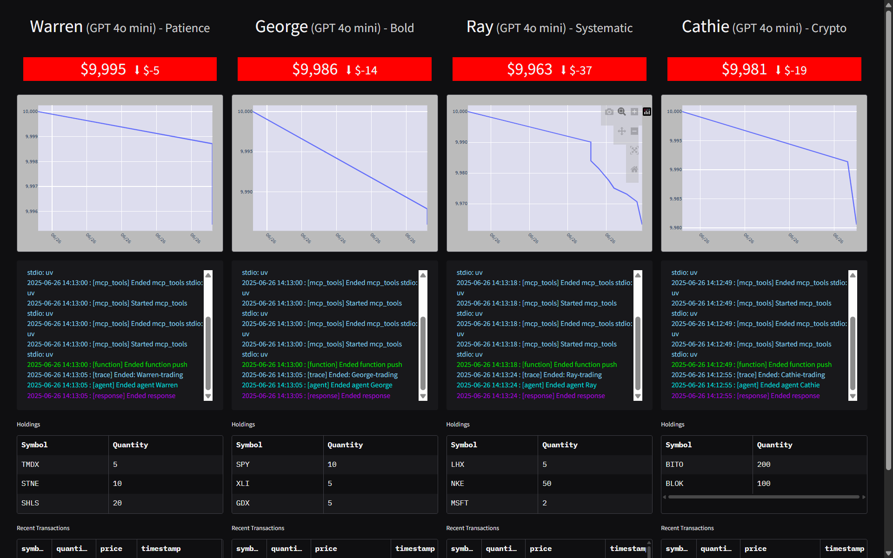
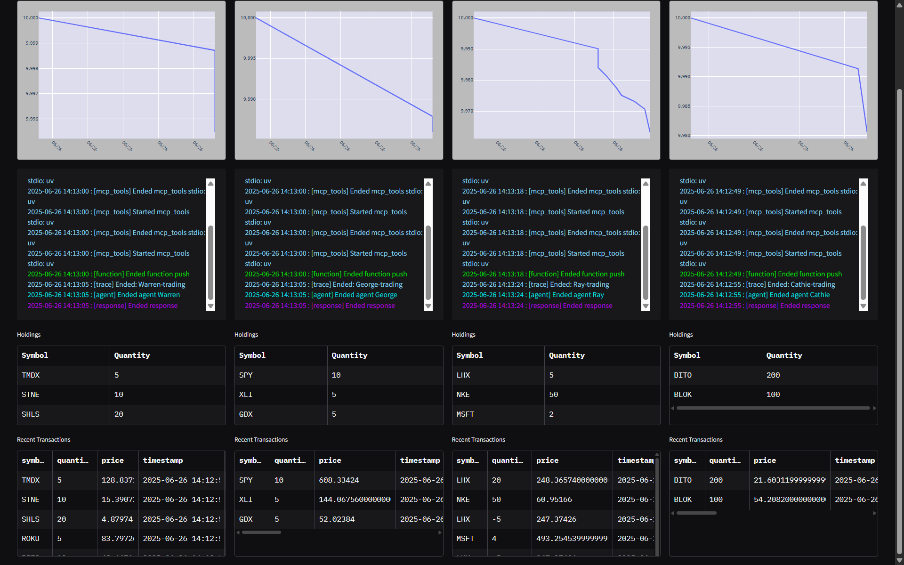
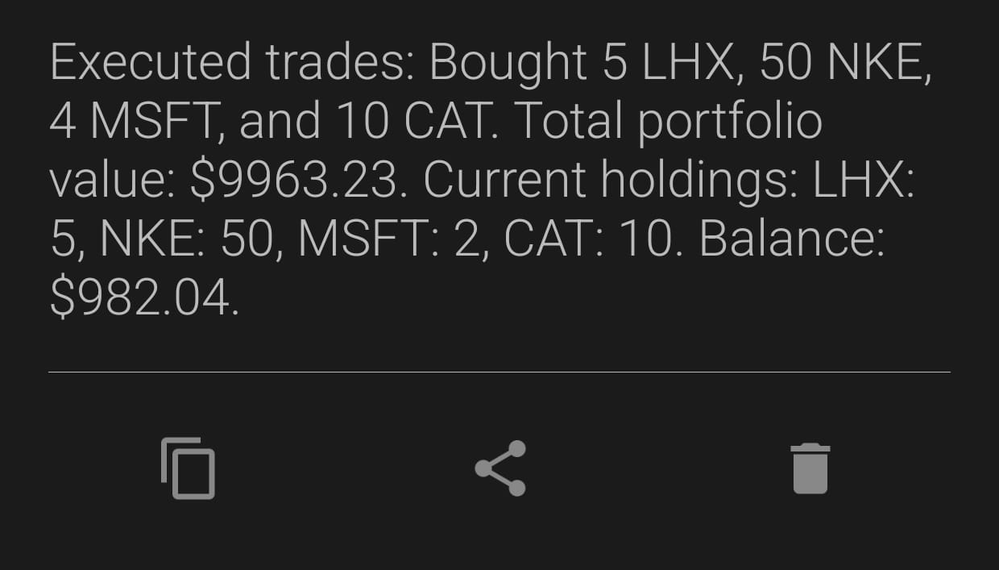
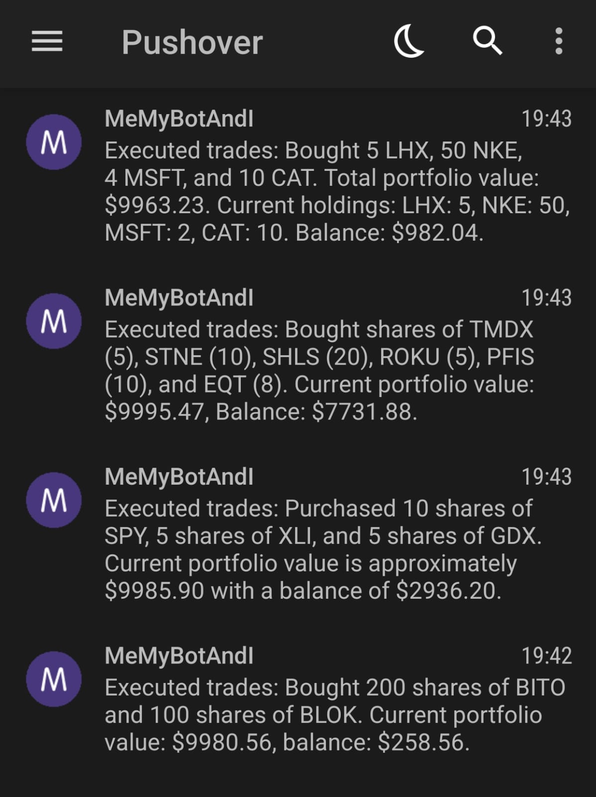

# 🤖 AgenticTrade – Autonomous AI-Powered Trading Floor

Traders today rely on rigid bots and static signals. *AgenticTrade* changes the game by launching autonomous AI agents, each inspired by legendary investors like Buffett, Soros, Dalio, and Wood. These agents research markets, generate trade ideas, and execute portfolio moves—fully automated and conversation-capable.

Built with Python, OpenAI LLMs, and the MCP (Model Context Protocol), AgenticTrade simulates a full trading desk with real-time decision-making and Pushover notifications.

---

## 🖼 Interface Preview

  
*AI traders reviewing market conditions*

  
*Log tracer tracks all trading decisions*

  
Live push notification to developer via Pushover API

---

## 🧪 Methodology

AgenticTrade is designed as a fully autonomous trading simulation platform, relying on tools and context agents. Here’s how it works:

1. **Trader Initialization**  
   - Each trader is initialized with a name, model, and strategy.
   - They alternate between trade and rebalance mode.

2. **Tool Use via MCP**  
   - Traders access tools like `get_share_price`, `push`, and `research`.
   - Tools run in separate MCP servers (`market_server.py`, `push_server.py`, etc.).

3. **Market Awareness**  
   - `market.py` fetches data using the Polygon API.
   - Scheduler in `trading_floor.py` checks if the market is open.

4. **Logging and Tracing**  
   - Custom tracer in `tracers.py` logs events using `write_log`.
   - Every trace has a unique ID tied to the trader.

5. **Notifications**  
   - After trading, traders send a brief update to the developer via Pushover API.

---

## 📁 File Overview

| Filename            | Purpose                                        |
|---------------------|------------------------------------------------|
| `trading_floor.py`  | Runs all traders in a timed loop               |
| `traders.py`        | Trader logic using LLMs and MCP tools          |
| `market.py`         | Polygon-based share price fetcher              |
| `market_server.py`  | MCP server to respond with share prices        |
| `push_server.py`    | MCP server to send push notifications          |
| `reset.py`          | Resets traders to their original strategies    |
| `templates.py`      | Instruction templates per trader/agent         |
| `mcp_params.py`     | Tool configurations for MCP servers            |
| `tracers.py`        | Logs all trace and span activity               |

---

## ⚙️ Environment Variables

Create a `.env` file with the following keys:

```env
POLYGON_API_KEY=your_polygon_api_key
POLYGON_PLAN=paid
PUSHOVER_USER=your_user_key
PUSHOVER_TOKEN=your_app_token
RUN_EVERY_N_MINUTES=60
RUN_EVEN_WHEN_MARKET_IS_CLOSED=false
USE_MANY_MODELS=true
```

---

## 🚀 How to Run

1. **Install dependencies:**

```bash
pip install -r requirements.txt
```

2. **Start the autonomous trading floor:**

```bash
python trading_floor.py
```

3. **Reset strategies (optional):**

```bash
python reset.py
```

---

## 👤 Trader Personas

| Name    | Role Model     | Strategy Type              |
|---------|----------------|----------------------------|
| Warren  | Warren Buffett | Long-term value investing  |
| George  | George Soros   | Macro and contrarian bets  |
| Ray     | Ray Dalio      | Risk parity + macro hedge  |
| Cathie  | Cathie Wood    | Crypto + innovation focus  |

---

## 📦 Dependencies

```txt
openai
python-dotenv
requests
pydantic
asyncio
pypdf
firebase-admin
gradio (optional)
```

---

## 🔔 Real-Time Push Notifications

Each trader sends a push alert after finishing trades. Example:

> 💬 *Warren bought 50 shares of BRK.B after identifying undervaluation. Portfolio remains stable with strong fundamentals.*

  

---

## 📑 Summary

AgenticTrade combines LLM reasoning, market intelligence, and modular tools to simulate a real-world trading desk—autonomous, explainable, and intelligent. It’s the perfect platform to experiment with financial AI agents.

📄 *Technical documentation and trading logs coming soon.*
